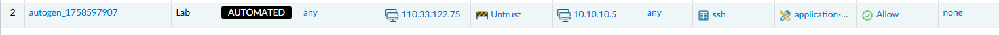

# Automatic New Policy Creation

When requests for access fall through and miss the preset policies, it is useful to be able to automate the policy 
creation anyway to prevent duplication. 

This repository includes handling for creating new policies by following this basic process:

1. Resolve source/destination IP to zones
2. Check the policy is actually required using `test security-policy match`
3. Add the required objects 
4. Add the security rule, using your specified location logic

!!! warning
    This automation does no computation of "rule location". You should either group your rules by specifying a rule
    to add all automated rules below using the `default_location_rule_name` and `default_rule_location` variables.

Without any changes, `add_policy.yml` will automatically add new policy and run through the zone resolution and test
process.

```shell
ansible-playbook playbooks/orchestrator/lab_policy.yml
```



## Zone resolution behavior

When a new policy is necessary, Panorama is queried for all of the connected devices, then we run a FIB lookup on each,
then take the outgoing interface and match it to a zone based on `show interface`.

Because of this, we may resolve the one IP address to several zones.

## Test behavior

Before adding a new rule, we test the traffic based on the provided source/destination and application on each
firewall connected to panorama. If the traffic is not already allowed, the creation will continue. This is documented
in more detail in the [Testing Security Policies](policy_lookup.md) section.

