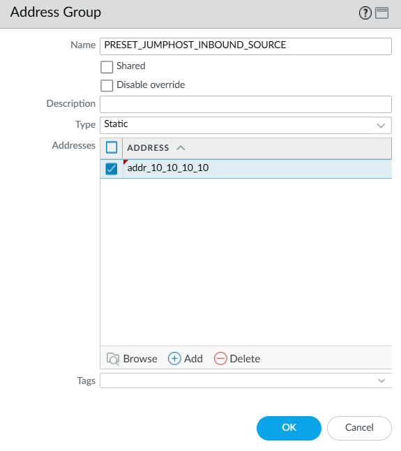
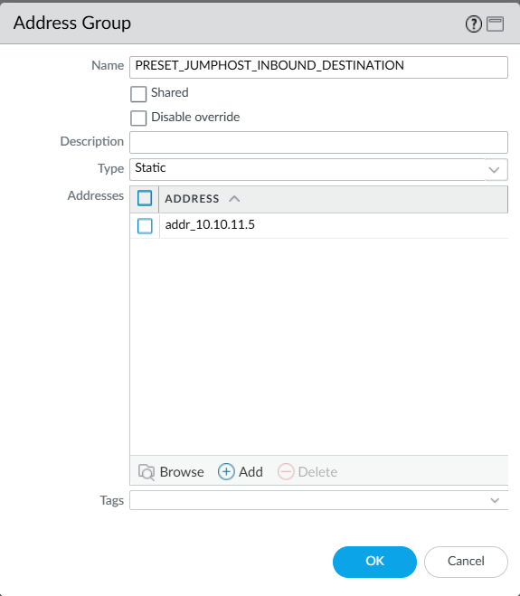
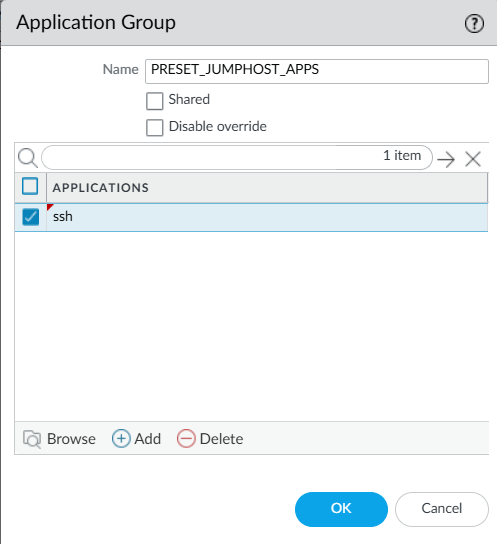
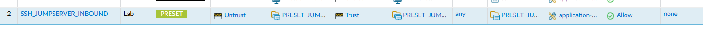

# Preset Policy Updates

"Preset" Policy gives you a way to implement security rule changes fully automatically, without dramatically impacting 
the structure of the rulebase.

Using Ansible, you can define what constitutes an acceptable, or sanctioned policy request, by mapping incoming
requests to specific parameters and then implementing changes based on that policy.

## Defining your Security Policy

First, you must consider what counts as a "sanctioned" security rule that you can add without requiring further user
input. 

Some examples would be:

 * Allowing incoming SSH access to a jump server from specific IPs for administrators
 * Allowing internet access to external load balancer routed IP addresses
 * Allowing communication between users and an internal file server

In these cases, the firewall administrator is not making a security policy decision when the implement new access.

With these high level policies in mind, you must convert them into actionable "filters"

## Building a Sanctioned Policy

!!! note
    This project intentionally does not abstract how the implementation works so that it is easy to customize. This
    means those that are building the policy will need to be familiar with Ansible concepts as well as Jinja2.

First, define your sanctioned policy in Firewall rule terms. For the rest of this guide we will be using the 
SSH Jump server access example.

This policy should allow any user requesting access to the jump server IP range from internet IPs. 

!!! note
    For this example, just pretend there's NAT in place and forget the destination network is a private IP :) 

source network | destination network | requesting user | application
--- |---------------------| --- | ---
not 10.0.0.0/24 | 10.10.11.0/24       | any | ssh

Now, **implement this policy in your Panorama instance**. This becomes your "preset" security policy!

### Create an Address Group for the Source

!!! warning
    PAN-OS requires that you specify at least one address when creating a new address group. In our case, we're setting
    up these groups essentially as placeholders, so you can either use a dummy address or something else logical.



### (Optional) Create an Address Group for the Destination

Repeat the above process, but creating an address group for the destination. **In our jump server example, you may 
only have one destination IP, in which case this step is unnessecary. It will become clear later!**



### (Optional) Create an Application Group 

If you want to allow the automated process to add applications to the preset policy, you can also create an application
group. This is usually most useful for user-sourced traffic (for example, users access internet applications like
Facebook).



### Create the Security Rule

Now you can actually define the rule in your security policy.

Because you are defining most of the parameters, this is the key to building scalable, reliable policy automation. 
You only need to decide where a rule goes **once**, you only need to worry about what is or is not permitted **once**,
and then it's repeatable forever (until you change your business requirements, anyway!)

Note that we reference the addresses and the app group in here, but we, as administrators, can decide all of the other
parameters. For example, we might restrict the rule to specific zones, or use specific ports, or enforce a certain
threat profile group, etc etc.



## Mapping incoming requests to Preset policy

Now that the policy has been defined, you can map incoming requests from users to the policy using automation.

### Create a Policy Tasks File

We use Ansible tasks and Jinja2 filters to map the policy to automation actions. This is as simple as using `set_fact` 
with a `when` clause. You can make this as complex as you like, Jinja2 offers a huge amount of filters out of the box,
and if you need to get more complex you can write your own custom python filters.

To implement our jump server access, we write a tasks file. For simplicity, you can store this in the `playbooks/orchestrator/preset`
directory, but you can put it whever makes sense for your environment.

```yaml title="ssh_jumpserver_inbound_access.yml"
---
# This is policy allowing users to access the jump server

- name: Match SSH Jumpserver access
  ansible.builtin.set_fact:
    policy_match: true # Set the fact that we did match a policy
    source_address_group: PRESET_JUMPHOST_INBOUND_SOURCE # In this case, the policy preset is an address_group type
    application_group: PRESET_JUMPHOST_APPS # If an application is passed, we should also include it in the policy.
    device_group: Lab # Finally, we set the device group!
  when:
    - "'10.10.11.0/24' | ansible.utils.network_in_network( destination_ip )"
    - "not '10.0.0.0/8' | ansible.utils.network_in_network( source_ip )"
```

### Including the policy

Now we **include** our new policy it as part of the [add_policy.yml](../../playbooks/orchestrator/add_policy.yml) playbook. 


```yaml title="add_policy.yml"
# --- START PRESET POLICY SECTION ---
# This section of tasks automatically updates existing, pre-built policies by simply updating existing address-groups
# and given applications to the given application groups.
# This allows for maximum control over the brownfield policy, but will only catch certain use cases.

# WEBSERVERS EXAMPLE
- name: Test against Webserver outbound policy
  ansible.builtin.include_tasks:
    file: preset/webservers_outbound_policy.yml

# SSH Jump Server Policy
- name: Test against SSH Jumpserver inbound policy
  ansible.builtin.include_tasks:
    file: preset/ssh_jumpserver_inbound_access.yml

# --- END PRESET POLICY SECTION ---
```

## Running the playbook

Run the `lab_policy.yml` playbook to deploy the policy.

```shell
ansible-playbook playbooks/orchestrator/lab_policy.yml
```
