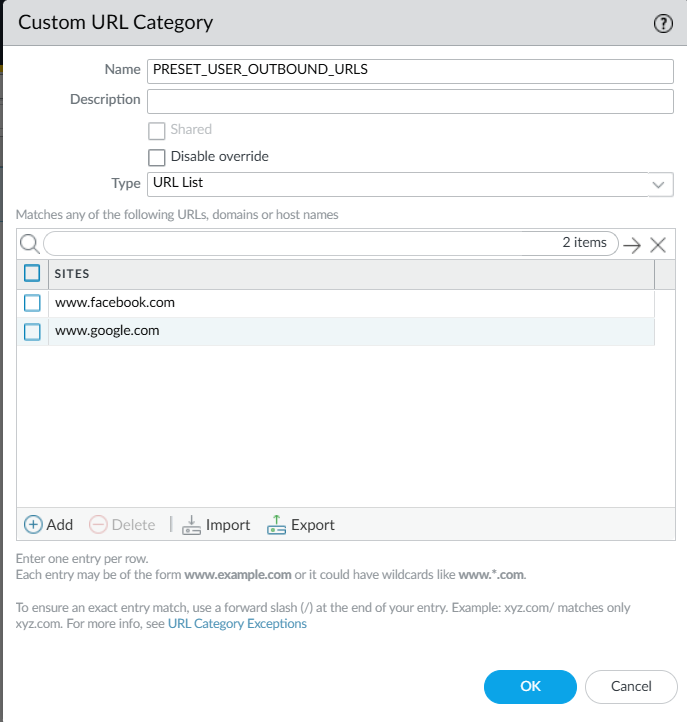
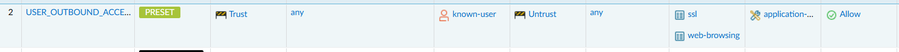

# Preset Policy - URL lists

Preset policy can also be based on URL lists based instead of IP. This is very useful when dealing with outbound user
access to internet websites.

## Building a Sanctioned URL List-based policy

For URL category based policy, most of the time a "sanctioned" policy is simply based on the requesting user.

So your policy may look like this:

source user group | destination website 
--- |---------------------|
Human Resources | www.facebook.com 

!!! note
    This automation does not resolve users to user-groups. That's up to you.

## Creating the URL List

Create the URL Category as a URL list in Panorama.



## Defining the preset security rule

Now, create a new security rule that references the created URL category.

It's up to you how much you "lock down" this policy. You could use specific applications, IPs, ports...whatever makes
sense for your environment. 



## Create a Policy Tasks File

(for more information on this, see [creating a policy tasks file](preset_policy.md#create-a-policy-tasks-file))

```yaml title="user_outbound_policy.yml"
---
- name: Match Users Internet Policy
  ansible.builtin.set_fact:
    policy_match: true # Set the fact that we did match a policy
    destination_url_category: PRESET_USER_OUTBOUND_URLS # In this case, the policy preset is a URL Category type
    device_group: Lab # Finally, we set the device group!
  when:
    - "source_user_group == 'Human Resources'"
    - url is defined
```

## Including the policy

(for more information on this, see [including your sanctioned policy](preset_policy.md#including-the-policy))

```yaml title="add_policy.yml"
# Outbound User access to websites
- name: Test against outbound user access
  ansible.builtin.include_tasks:
    file: preset/user_outbound_policy.yml
```

## Running the playbook

Note that nothing changes from the point of execution. You still run the same playbook, and as long as you're including
`add_policy.yml`, any policies that define a destination_url_category will correctly update the category.

```shell
ansible-playbook playbooks/orchestrator/lab_policy.yml
```